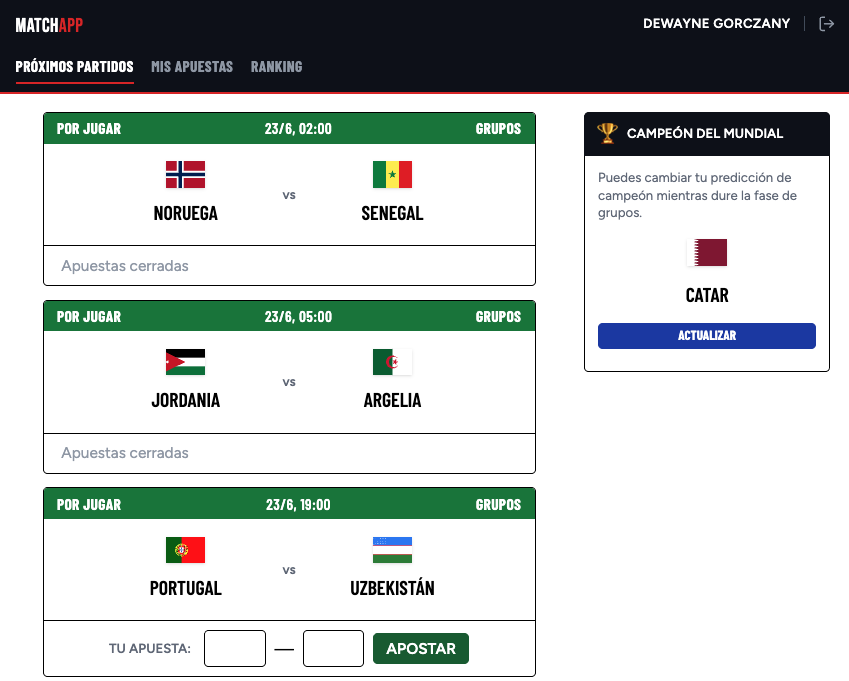
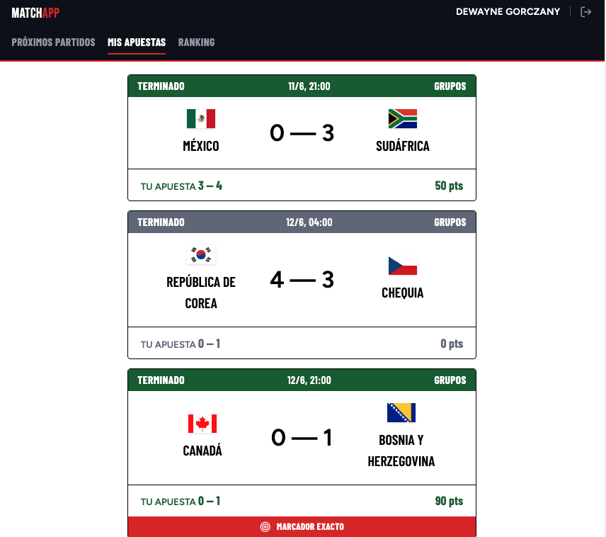
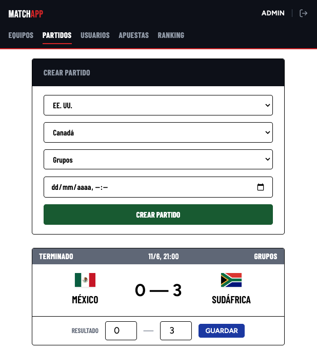

# Match-Appi Frontend ⚽

Cliente React para la porra del Mundial 2026. Consume la API REST del proyecto [Match-Appi](https://github.com/aproposito/Match-Appi) y permite a los usuarios predecir resultados de partidos, consultar el ranking y gestionar su cuenta. Los administradores disponen de un panel propio para gestionar equipos, partidos y usuarios.

Proyecto desarrollado como ejercicio S5.02 del Bootcamp FullStack PHP en IT Academy Barcelona Activa.

---

## 🛠 Tecnologías

- **Framework:** React 19 (function components y hooks)
- **Build tool:** Vite
- **Estilos:** Tailwind CSS v4
- **Routing:** React Router v7
- **Testing:** Vitest · React Testing Library · jsdom
- **Tipografías:** Bunny Fonts (Bebas Neue · Barlow Condensed · Figtree)
- **Herramientas:** npm · Git

---

## ✨ Funcionalidades

### Usuario

- Login y cierre de sesión con token Bearer (Laravel Passport)
- Jornada del día: partidos de la ventana activa con predicción por partido
- Predicción del campeón del Mundial (editable durante la fase de grupos)
- Historial de apuestas con puntuación desglosada por partido
- Ranking general ordenado por puntos totales
- Perfil: editar nombre/email, cambiar contraseña y eliminar cuenta

### Administrador

- Gestión de equipos: listar, crear, editar y eliminar
- Gestión de partidos: crear, introducir resultados inline y eliminar
- Gestión de usuarios: ver, editar y eliminar
- Vista de todas las predicciones con filtro por usuario
- Ranking compartido con la vista de usuario

---

## 🗺 Estructura de rutas

| Ruta | Componente | Acceso |
|------|------------|--------|
| `/login` | `LoginForm` | Público |
| `/matches` | `MatchList` | Usuario |
| `/history` | `BettingHistory` | Usuario |
| `/ranking` | `Ranking` | Ambos |
| `/profile` | `ProfileForm` | Usuario |
| `/admin/teams` | `AdminTeams` | Admin |
| `/admin/matches` | `AdminMatches` | Admin |
| `/admin/users` | `AdminUsers` | Admin |
| `/admin/predictions` | `AdminPredictions` | Admin |

---

## 📸 Capturas

**Jornada del día** — partidos de la ventana activa con formulario de apuesta y predicción del campeón en columna lateral:


**Historial de apuestas** — resultado real, apuesta del usuario, puntos obtenidos y banda de marcador exacto:


**Panel de administración** — navbar diferenciada por rol, formulario de crear partido y edición inline de resultados:


---

## 🚀 Instalación

### Requisitos previos

- Node.js >= 18
- El backend [Match-Appi](https://github.com/aproposito/Match-Appi) instalado y corriendo en `http://127.0.0.1:8000`

### Pasos

```bash
# 1. Clonar el repositorio
git clone https://github.com/aproposito/Match-Appi-Frontend.git
cd match-appi-frontend

# 2. Instalar dependencias
npm install

# 3. Iniciar el servidor de desarrollo
npm run dev
```

La app quedará disponible en `http://localhost:5173`.

---

## 🧪 Testing

```bash
# Ejecutar todos los tests
npm test
```

Los tests cubren los componentes principales con Vitest y React Testing Library, mockeando las llamadas a la API.

### Credenciales de prueba

Mismas que en el backend:

| Rol | Email | Contraseña |
|-----|-------|------------|
| Admin | admin@matchappi.com | 12345678 |
| Usuario | user@matchappi.com | 12345678 |

---

## 🏗 Arquitectura

```
src/
├── api/
│   └── client.js          # Cliente HTTP centralizado (get/post/put/del)
├── components/
│   ├── MatchCard.jsx       # Tarjeta de partido reutilizable
│   ├── MatchList.jsx       # Jornada del día + ChampionPrediction
│   ├── ChampionPrediction.jsx
│   ├── PredictionForm.jsx
│   ├── BettingHistory.jsx
│   ├── Ranking.jsx
│   ├── ProfileForm.jsx
│   ├── PageLayout.jsx      # Wrapper de layout compartido
│   ├── admin/
│   │   ├── AdminMatches.jsx
│   │   ├── AdminTeams.jsx
│   │   ├── AdminUsers.jsx
│   │   └── AdminPredictions.jsx
│   └── ...
└── App.jsx                 # Rutas y nav diferenciado por rol
```

---

## 📋 Sistema de puntuación

| Acierto | Puntos |
|---------|--------|
| Resultado (signo) | 50 |
| Goles equipo local exactos | 20 + 5 por cada gol > 2 |
| Goles equipo visitante exactos | 20 + 5 por cada gol > 2 |
| Acertar el campeón del Mundial | 150 |

---

## 🔗 Repositorio del backend

[Match-Appi (API REST Laravel)](https://github.com/aproposito/Match-Appi)

---

## 👤 Autor

**Álvaro Martínez Aldama**
[LinkedIn](https://www.linkedin.com/in/alvaro-martinez-aldama/) · [GitHub](https://github.com/aproposito/)

Proyecto académico — IT Academy Barcelona Activa · Sprint 5 · 2026
